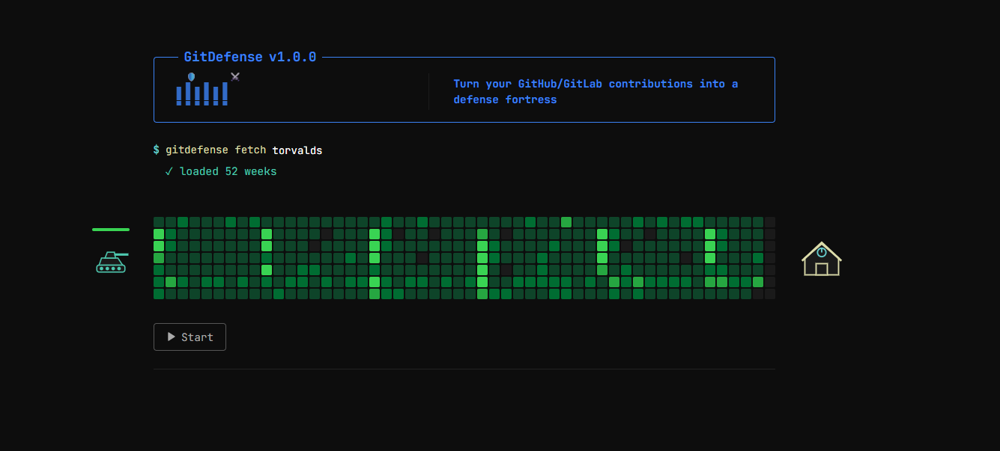

# GitDefense 🛡️

> Turn your GitHub & GitLab contributions into a terminal-style tower defense game.

[](https://gitdefense.vercel.app/)

GitDefense scans a GitHub or GitLab username for their 52-week contribution history and transforms it into a live tower defense battle. An enemy tank rolls across your contribution grid — each green block is a wall of resistance. The denser your coding activity, the harder the tank gets hit. Will your streak survive the assault?



---

## 🎮 How It Works

1. **Enter a username** via the terminal-style prompt:
   ```
   $ gitdefense fetch <username>
   ```
2. Your contribution graph loads as a **52-column battlefield**.
3. Hit **Start** — the tank rolls in from the left toward your base on the right.
4. Each week column deals damage to the tank based on contribution levels (Level 1–4).
5. **You WIN** if the tank runs out of HP before reaching the base.
6. **You LOSE** if the tank breaks through and destroys the base.

> **Tip:** Force a specific platform with `-p`:
> ```
> $ gitdefense fetch username -p gitlab
> ```

---

## ✨ Features

- **🎮 Tower Defense Gameplay** — Contribution blocks deal real damage. Higher commit levels = stronger walls.
- **🔊 Sound Effects** — Hit sounds on collision, explosion on tank death, laser + blast when the base is destroyed.
- **🏆 Win/Lose Screen** — Terminal-styled overlay with `YOU WIN` / `YOU LOSE` and a Play Again button.
- **🌐 Multi-Platform** — Supports both GitHub and GitLab contribution data.
- **💻 Terminal Aesthetic** — Dark-mode, monospace, hacker-console UI with JetBrains Mono font.
- **📱 Responsive** — Works on desktop and mobile with scrollable contribution grid.
- **🔗 Shareable Links** — Direct URLs like `/username` auto-fetch and load the game.
- **📦 Embeddable Widget** — Embed a compact version of the game on any website via `<iframe>`.

---

## 🛠 Tech Stack

| Layer | Technology |
|---|---|
| Frontend | React 19 + Vite 7 |
| Animations | Framer Motion |
| Sound Engine | Tone.js |
| Data Fetching | Axios + date-fns |
| GitHub Data | [github-contributions-api](https://github.com/grubersjoe/github-contributions-api) |
| GitLab Data | Vercel Serverless Function proxy (`/api/gitlab`) |
| Styling | Vanilla CSS (CSS Variables design system) |
| Font | JetBrains Mono (Google Fonts) |

---

## 🚀 Local Development

```bash
# Clone the repo
git clone https://github.com/hoonz565/gitdefense.git
cd gitdefense

# Install dependencies
npm install

# Start the dev server (includes GitLab proxy via Vite)
npm run dev
```

---

## 📦 Deployment (Vercel)

```bash
# Build for production
npm run build

# Deploy to Vercel (serverless function for GitLab proxy is included automatically)
vercel --prod
```

---

## 🎵 Credits

Original UI architecture and contribution graph concept inspired by [GitMusic](https://github.com/niyamax/gitmusic.git) by [@niyamax](https://github.com/niyamax).

---

## 📜 License

MIT